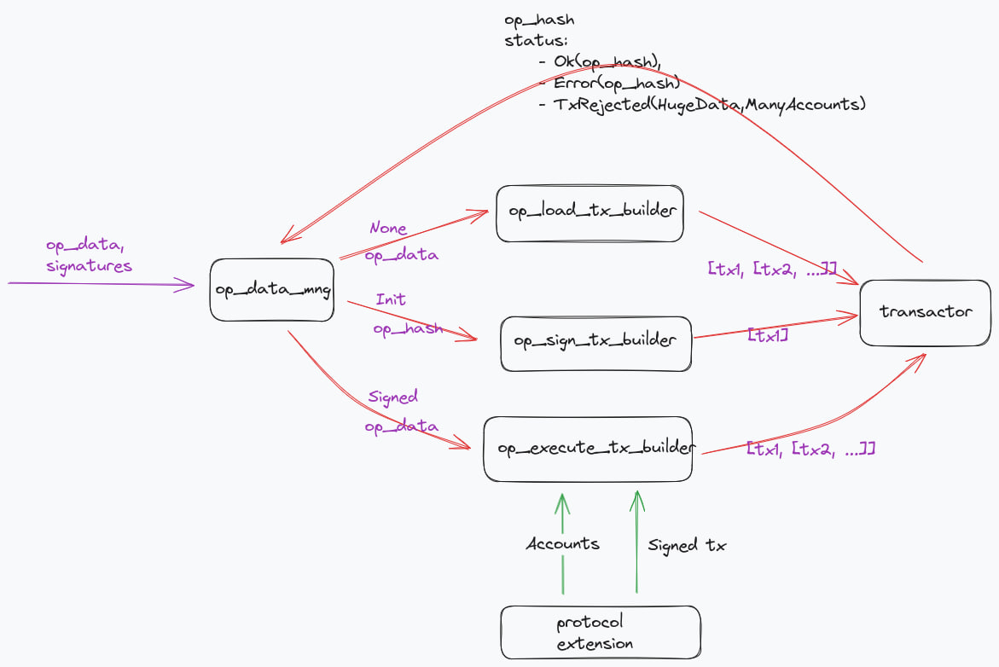

<div align="center">

  <a href="https://entangle.fi/">
  
  </a>

  <h1>Photon</h1>

  <p>
    <strong>Cross-chain messaging protocol</strong>
  </p>

  <p>
    <a href="https://docs.entangle.fi/entangle-components/photon-messaging"></a>
  </p>
</div>

Photon Messaging is an omnichain protocol that facilitates secure and efficient cross-chain communication for both EVM and non-EVM blockchains. It enables developers to send customized messages across diverse blockchain networks, supporting seamless asset transfers and operations.

## Components & Docs

- Operational flow of sending decentralized blockchain operations goes through an intricate network of smart contracts such as [Endpoint system](https://docs.entangle.fi/entangle-components/photon-messaging/end-points-system).
- Photon [Agent network](https://docs.entangle.fi/entangle-components/photon-messaging/entangle-agent-network) is a Delegated Proof of Stake (DPoS) distributed architecture with off-chain machines.
- [Photon Executors](https://docs.entangle.fi/entangle-components/photon-messaging/executors) backend programs tasked with retrieving and executing approved operations from various blockchains.
- [Photon Data Streamer](https://docs.entangle.fi/entangle-components/photon-messaging/photon-data-streamer) is part of the Photon infrastructure, optimized for real-time data transmission to enable immediate processing and analysis
- [Universal Data Feeds](https://docs.entangle.fi/entangle-components/universal-data-feeds) is part of the Photon infrastructure created for collection, processing and disributing data of any format between different blockchains.

Refer to the Photon Messaging [Docs](https://docs.entangle.fi/entangle-components/photon-messaging) for building and integrating into Photon.

### The mentioned set of components for the Solana blockchain

- [photon messaging endpoint](programs/entangle-photon-sol) - implements the messaging protocol.
- [listener service](transmitter-module/src/listener_app) - listens to the endpoint for incoming proposal events.
- [executor service](transmitter-module/src/executor_app) - processes signed transactions as prescribed by the Solana
  blockchain.

### User protocol example and testing facilities

- [onefunc solana program](programs/onefunc) - can be registered at the endpoint contract as a protocol address and may
  function as a called program or a proposer program.
- [onefunc extension](transmitter-protocol-extensions/onefunc-extension) - provides an opportunity to extend the
  operation execution stage with additional accounts and signatures
- [test transmitter](transmitter-test-listener) - serves as a core transmitter to process proposals and relay them to
  the entangle oracle blockchain. It is designed to emulate a transmitter in testing scenarios and sets the
  last_processed_block value for failure recovery.
- [test publisher](transmitter-test-publisher) - a small CLI tool that offers two commands, init-owned-counter and
  increment-owned-counter, to showcase the invocation of on-chain functions through an endpoint contract, as used in
  cross-chain messaging.

## Testing the photon cross-chain messaging functionality in the local environment

Follow the instruction below to set up a test environment and verify that photon messaging events are accurately
captured and relayed between the transmitter core component and other entities.

### Building photon messaging Endpoint and onefunc sample program

A widely used way of making solana programs implemented with [Anchor](https://www.anchor-lang.com/) is as follows

```sh
RUSTFLAGS="--cfg feature=\"devnet\"" anchor build
```

### Running solana test validator

To run the solana test validator with previously compiled solana programs, you can use the following command

```sh
solana-test-validator --reset --config solana_config.yml --bpf-program keys/genome-keypair.json target/deploy/genome.so --bpf-program keys/photon-keypair.json target/deploy/photon.so --bpf-program keys/ngl_core-keypair.json target/deploy/ngl_core.so --bpf-program keys/onefunc-keypair.json target/deploy/onefunc.so --bpf-program metaqbxxUerdq28cj1RbAWkYQm3ybzjb6a8bt518x1s mpl_token_metadata.so
```

The test script facilitates a range of government operations available through the photon messaging endpoint. These
operations include initializing government settings with transmitters and establishing consensus rates, as well as
adding new protocols. It also sets up transmitters and targets rates for these protocols, alongside specifying executor
and proposer addresses. Additionally, the script is designed to execute test protocol operations by referencing their
names and corresponding codes.

So that the Photon messaging on-chain state is initialized by calling the photon tests as follows

```sh
anchor test --skip-local-validator --skip-build --skip-deploy
```

Alternatively, the photon messaging state can be initialized using the migration script, which is commonly employed to
set up photon in actual networks `devnet`, `mainnet`.

```sh
solana airdrop --url localhost -k keys/owner.json 10 && solana airdrop --url localhost -k keys/gov-executor.json 10
anchor deploy --program-name photon --provider.cluster localnet --program-keypair keys/photon-keypair.json --provider.wallet keys/owner.json
anchor migrate --provider.cluster localnet --provider.wallet ../keys/owner.json
```

### Rabbitmq and MongoDb

RabbitMQ and MongoDB are important components of interprocess communication during the messaging procedure. They need to
be started before the other components of a local environment to establish queues and provide last_processed_block
for retrospective event analysis. It's recommended to use the following command to up them

```sh
docker compose -f docker/docker-compose.yml up rabbitmq mongo -d
```

### Solana listener

The Solana listener service is a module designed to manage events from the cross-chain messaging endpoint. These events
typically relate to operations of distributed protocols or services, such as adding allowed protocols that are then
transmitted to the entangled blockchain and the Master contract within it.

Listener service could be started as follows

```sh
RUST_LOG=debug
ENTANGLE_RABBITMQ_USER=guest
ENTANGLE_RABBITMQ_PASSWORD=guest
cargo run --release -p transmitter-module -- listener --config transmitter-module/doc/listener-config.yml
```

Additionally, a [transmitter-test-listener](transmitter-test-listener) is available to verify that intercepted
proposals are correctly transmitted to the from_solana RabbitMQ message queue as expected.

```sh
cargo run --package transmitter-test-listener --bin transmitter-test-listener -- listen --config transmitter-test-listener/test-listener-config.yml
```

### Solana executor

The Solana executor service is a specialized module that executes operations within the target contract on the
destination chain. The executor retrieves operations from the to_solana RabbitMQ message queue, repackages them into a
set of Solana transactions, and processes them as specified. Each operation correlates with a specific protocol, which
specifies a series of program-derived addresses associated with the photon messaging endpoint. It's crucial to note that
executing a particular protocol on Solana requires a set of precalculated addresses to be included in the transaction.

<div style="text-align: center;"></div>

To facilitate this, the concept of an extension has been integrated into the executor. Although this guide does not
explore the design and implementation details of these extensions, it's important to recognize that they must be
compiled and configured for dynamic linking. A list of these extensions can be found in
the [executor configuration file](transmitter-module/doc/executor-config.yml).

```sh
cargo build --release -p gov-extension -p onefunc-extension -p bridge-extension
```

```sh
export ENTANGLE_RABBITMQ_PASSWORD=guest
export ENTANGLE_RABBITMQ_USER=guest
export ENTANGLE_SOLANA_PAYER=4F7NuvMHvfTAeG47WaXWUP5rkyhqbKSQPzbXQAQHj5PXg8YbQs5Dt1PspaAWeAHnQqifFvFFQjc91gcnTjRCNaeU;
export RUST_LOG=info,gov_extension=debug,transmitter_module=debug
cargo run --package transmitter-module -- executor --config transmitter-module/doc/executor-config.yml
```

Where `ENTANGLE_SOLANA_PAYER` is executor keypair encoded in base58, it's a test account that is also available
at `tests/accounts`.
That is worth to mention there is the [onefunc extension](transmitter-protocol-extensions/onefunc-extension) that
should be compiled and set up in the executor configuration file.

### Test executing operations

The operations of the [`onefunc`](programs/onefunc) test protocol can be run independently of the entangle oracle
blockchain by simulating the core transmitter module with the [test-publisher](transmitter-test-publisher)

```sh
export ENTANGLE_RABBITMQ_PASSWORD=guest
export ENTANGLE_RABBITMQ_USER=guest
export RUST_LOG="info,test_publisher=debug"
cargo run --release --package test-publisher -- init-owned-counter --config transmitter-test-publisher/publisher-config.yml
cargo run --release --package test-publisher -- increment-owned-counter --config transmitter-test-publisher/publisher-config.yml  --value 2 --times 1
```

### Update extensions without stopping the executor

To update the internal state without stopping the executor service, it is possible to reload the extension list from the
configuration by sending a SIGHUP.

```she
pgrep -a transmitter
105971 target/debug/transmitter-module executor --config transmitter-module/doc/executor-config.yaml
kill -1 105971
```

## Docker environment

For users who prefer not to compile tools from source, there's the option to use a Docker environment.

### Build solana test validator image

To construct an image of a functional Solana node for testing purposes, include the preloaded photon crosschain
messaging endpoint program and the onefunc program. These are accessible via the executor and listener modules.

```sh
docker build -t entangle:solana -f docker/Dockerfile_solana .
```

## Build solana module image

Everything else that are implemented in this repository are available in the `solana-module` image including listener
and executor functionality, testing facilities etc.

```sh
docker build -t entangle:solana-module -f docker/Dockerfile_module .
```

### Start test environment with docker-compose

The docker-compose file outlines a set of containers that includes a Solana test validator, RabbitMQ, MongoDB, executor,
and listener. The environment can be started as follows:

```sh
docker-compose -f docker/docker-compose.yml up
```

### Produce an operation with test publisher

For the test purposes the publishing signed operation data is also provided

```sh
docker run --network entangle -e "ENTANGLE_RABBITMQ_USER=guest"\
                              -e "ENTANGLE_RABBITMQ_PASSWORD=guest"\
                              -e "RUST_LOG=debug" \
           --rm -it --entrypoint './test-publisher'  --name publisher entangle:solana-module\
           init-owned-counter --config publisher-config.yml
```

```sh
docker run --network entangle -e "ENTANGLE_RABBITMQ_USER=guest"\
                              -e "ENTANGLE_RABBITMQ_PASSWORD=guest"\
                              -e "RUST_LOG=debug" \
           --rm -it --entrypoint './test-publisher'  --name publisher entangle:solana-module\
           increment-owned-counter --value 2 --times 1 --config publisher-config.yml
```

As an additional feature, you can retrieve an operation info account or a protocol info account from the executor log to
examine the details of the operation as shown below:

```sh
anchor account --provider.cluster localnet photon.ProtocolInfo Cwz8yzNL7apxnPPHdMofzDfEAwTQffPKtFjGqgX9iGZC | jq -c
anchor account --provider.cluster localnet photon.OpInfo 4RGTy1KewRfAFBTCuRD5pDVYVsM8PjGU2D2Ko3VqXejC | jq -c
```

## Generating Rust Documentation

To compile the Rust documentation for deployment, use the following command. This generates the docs specifically for
the packages that are part of this project and is intended for further distribution via crates.io and docs.rs.
The command omits dependencies to focus solely on your packages and opens the compiled docs in your default browser for
review.

```sh
cargo doc --no-deps -p entangle-photon-sol -p onefunc-extension -p transmitter-module -p transmitter-common -p gov-extension -p test-publisher -p onefunc --open
```

[gitbook]: https://entangle-1.gitbook.io/entangle/entangle/overview/photon-messaging-layer

[image]: https://entangle-1.gitbook.io/~gitbook/image?url=https:%2F%2F758965771-files.gitbook.io%2F%7E%2Ffiles%2Fv0%2Fb%2Fgitbook-x-prod.appspot.com%2Fo%2Fspaces%252FW4hWFoOg1bsy9f1Z6FWM%252Fuploads%252FzTNtzkvpHmvi80k7Nb1p%252F1.png%3Falt=media%26token=4835b28b-cec4-46c9-8856-5110d8e3078d&width=768&dpr=1&quality=100&sign=d84c0f2a1f69e12d6b7341cac8e0f08cfe007d7405a6764ea908b70ae1508356
